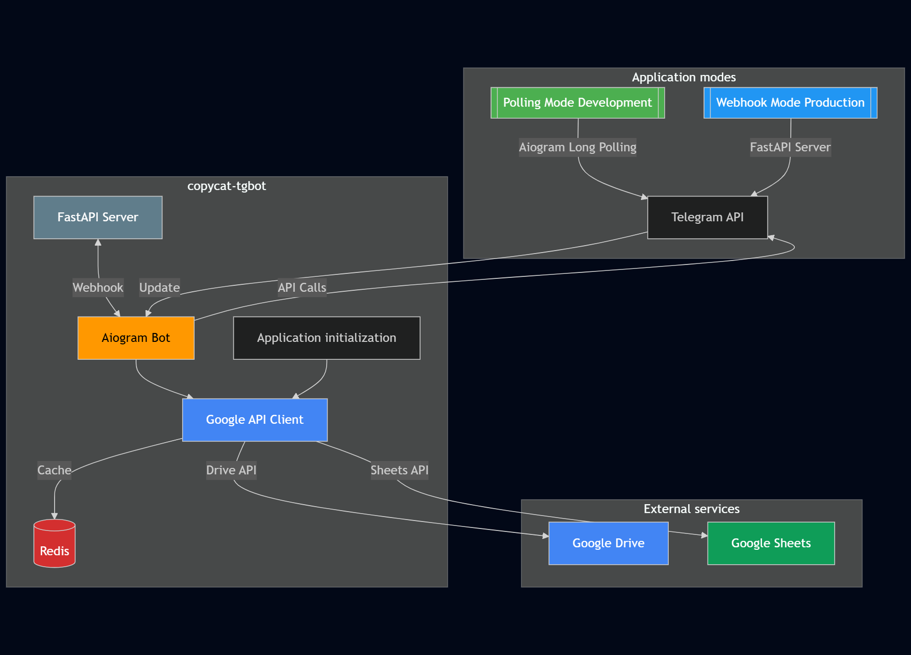

# 🐍 copycat-tgbot

Шаблонный Telegram-бот с интеграцией Google API (Drive и Sheets), FastAPI-сервером для обработки вебхуков и Redis для кэширования данных.



## 🌟 Особенности
- Интеграция с Google Drive и Sheets API
- FastAPI-сервер для обработки вебхуков
- Кэширование данных через Redis
- Готовый шаблон для быстрого развертывания
- Поддержка как polling (для разработки), так и webhook (для production) режимов

## 🛠 Технический стек
- **Python 3.12+**
- **Aiogram 3.18** - фреймворк для Telegram бота
- **FastAPI** - веб-сервер для обработки вебхука
- **Google API Client** - работа с Google Drive и Sheets
- **Redis 5.2+** - кэширование данных
- **Poetry** - управление зависимостями

## 🧩 Шаблонизация
### (Вариант 1) Клонирование репозитория
```bash
git clone git@github.com:shurikinfo/copycat-tgbot.git # Скачиваем репозиторий
cd copycat-tgbot # Переходим в папку проекта
bash template.sh <название бота: bot-books> # Запускаем скрипт, который автоматически переименует всё на название нового проекта
```
### (Вариант 2) Скоро... 

## ⚙️ Установка

### Требования
- Python 3.12 или новее
- Poetry
- Redis server
- Аккаунт Google Cloud Platform (для работы с API)
- Telegram Bot Token от @BotFather: [Инструкция для получения токена](https://core.telegram.org/bots#how-do-i-create-a-bot)

### Установка зависимостей
```bash
poetry install
```
### (Опционально) Активация виртуального окружения
```bash
poetry shell
```

## 🔧 Конфигурация
> Для простоты использования хранение секретов реализовано через .env, однако, никто не ограничивает в том, чтобы положить всё в более надежное место...
1. Создайте файл .env в корне проекта (на основе .env.example):

```
BOT_TOKEN=your_telegram_bot_token
GOOGLE_EMAILS=mail@gmail.com,mail1@gmail.com # Список email, которым нужно предоставить доступ к файлу 
GOOGLE_FILE_NAME=books_list # Название документа, который используется приложением (Sheets)
WEBHOOK_URL=https://yourdomain.com/webhook # Для production (https!)
```
2. Добавьте файл с доступами к сервисному аккаунту Google (по аналогии с google_credentials.json.example)
```
{
  "type": "service_account",
  "project_id": "",
  "private_key_id": "",
  "private_key": "",
  "client_email": "",
  "client_id": "",
  "auth_uri": "https://accounts.google.com/o/oauth2/auth",
  "token_uri": "https://oauth2.googleapis.com/token",
  "auth_provider_x509_cert_url": "https://www.googleapis.com/oauth2/v1/certs",
  "client_x509_cert_url": "",
  "universe_domain": "googleapis.com"
}
```

## 🚀 Запуск
### Локальная разработка (polling режим)
```bash
python copycat_tgbot/run.py
```

### Production (webhook режим)
Для запуска на бою лучше запускать через ASGI, используя webhook, который будет дергать Telegram при обращении к боту.

1. Установите вебхук в Telegram:
```bash
curl -F "url=https://yourdomain.com/webhook" \
     https://api.telegram.org/bot<BOT_TOKEN>/setWebhook
````
2. Запустите FastAPI сервер:
```bash
uvicorn copycat_tgbot.asgi:app.server.app --host 0.0.0.0 --log-level error
```

## 📊 Интеграция с Google API
### Настройка доступа
- Создайте проект в [Google Cloud Console](https://console.cloud.google.com/)
- Включите API для Google Drive и Sheets
- Создайте сервисный аккаунт и скачайте google_credentials.json
- Поместите файл в корень проекта
